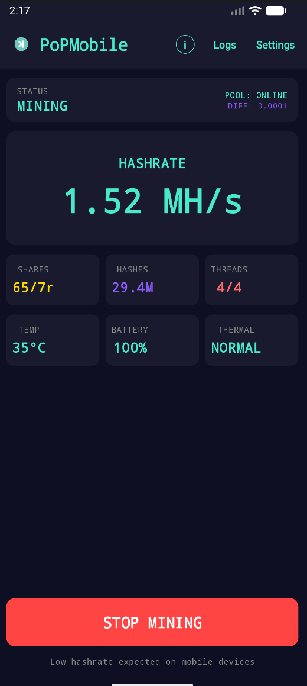
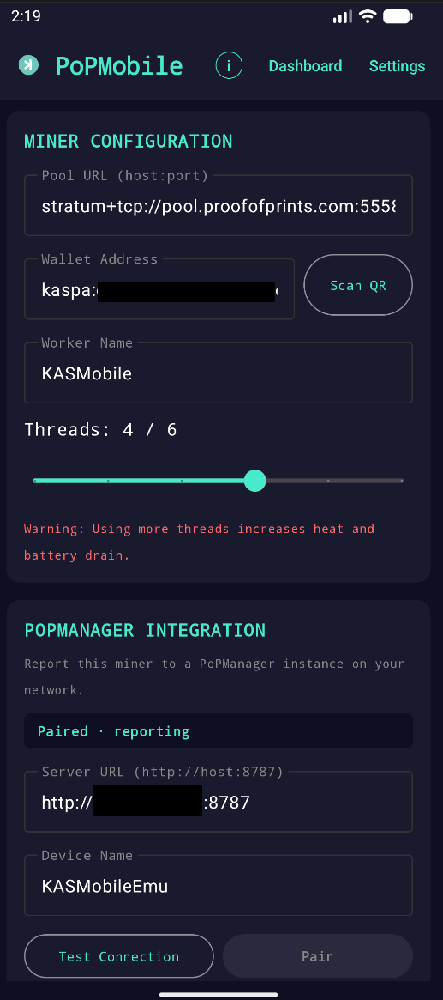
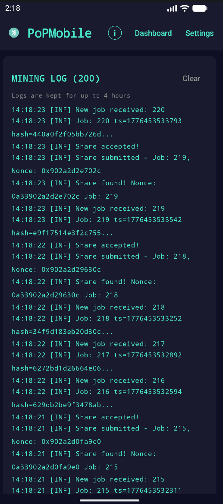

# PoPMobile

Kaspa kHeavyHash miner for Android, with optional [PoPManager](https://github.com/proofofprints/PoPManager) integration for remote monitoring and control.

> **Low hashrate expected on mobile devices.** Do not expect meaningful profit — treat it as lottery-style mining.

<p align="center">
  
  
  
</p>

## Features

- **Native kHeavyHash miner** ported from the KASDeck ESP32 miner, compiled for `arm64-v8a`, `armeabi-v7a`, and `x86_64`
- **Stratum v1 client** with `mining.subscribe` / `mining.authorize` / `mining.submit`, extranonce support, and a 10 s connect timeout
- **Pool connection UX** — `CONNECTING` / `CONNECTED` / `ERROR` states with specific reasons (`REFUSED`, `TIMED OUT`, `DNS FAILED`, `UNREACHABLE`, `NO NETWORK`); cancellable even during a stuck retry
- **Thermal monitoring + auto-throttle** — pauses mining when the device hits critical temperatures
- **Live battery / temp / thermal-state dashboard** alongside hashrate, accepted/rejected shares, hash total, and thread count
- **QR code scanning** for the Kaspa wallet address (bundled ZXing — works offline, no Play Services required). Handles bare addresses, `kaspa:kaspa:…` double-prefixed URIs, and `?amount=` query params
- **Configurable thread count** (1…CPU cores) with a warning band for heavy settings
- **Foreground service** keeps mining alive in the background with a persistent notification and a one-tap Stop action
- **Mining log** — the last 4 hours of stratum/hashing events, viewable from the Logs tab
- **PoPManager integration** — pair once with a 6-digit code, then telemetry posts every 30 s and remote commands (`set_config`, `set_threads`, `start`, `stop`, `restart`) are applied and acknowledged

## Requirements

- Android 8.0 (API 26) or newer
- ARMv7, ARM64, or x86\_64 CPU
- Internet access (cellular or Wi-Fi) to reach the pool
- A Kaspa wallet address (the payout goes here)

> **Note:** v1 has been tested on the Android emulator and a single physical device (TCL A3X). Behavior on other Android versions and OEM skins has not been exhaustively verified — please [open an issue](https://github.com/proofofprints/PoPMobile/issues) if something misbehaves on your device.

## Install

### Option A — Sideload the signed APK from Releases

1. Download the latest `popmobile-vX.Y.Z.apk` from the [Releases page](https://github.com/proofofprints/PoPMobile/releases).
2. On your phone, allow **Install unknown apps** for your browser or file manager (Settings → Apps → Special app access).
3. Tap the downloaded APK and confirm.

### Option B — Build from source

```bash
git clone https://github.com/proofofprints/PoPMobile.git
cd PoPMobile
# Open in Android Studio, or build from the CLI:
./gradlew assembleDebug        # unsigned debug APK
./gradlew assembleRelease      # signed release APK (requires keystore.properties — see below)
```

The APK will be in `app/build/outputs/apk/{debug,release}/`.

## Configure

After first launch, open **Settings**:

| Field | What to set |
| --- | --- |
| **Pool URL** | `stratum+tcp://host:port` — e.g. `stratum+tcp://pool.proofofprints.com:5558` |
| **Wallet Address** | Your `kaspa:…` payout address. Paste it, or tap **Scan QR** to use the camera |
| **Worker Name** | Any label you like — shows up in pool stats. Defaults to `PoPMobile` |
| **Threads** | How many CPU cores to mine on. More threads = more heat and battery drain |

Tap **SAVE** (the "Settings saved!" notice appears above the button), then go back to the Dashboard and tap **START MINING**.

### Supported Kaspa QR formats

- Bare: `kaspa:qyp…`
- Double-prefixed: `kaspa:kaspa:qyp…` (emitted by some wallets)
- With amount: `kaspa:qyp…?amount=1.5`

All three are accepted; the app normalises to the bare form before saving.

## PoPManager integration

[PoPManager](https://github.com/proofofprints/PoPManager) is a self-hosted dashboard that can monitor and control multiple Kaspa miners (including Iceriver ASICs and PoPMobile instances).

### Pair a device

1. In PoPManager, click **Add Miner → Pairing Code**. Copy the 6-digit code.
2. In PoPMobile → **Settings** → **PoPManager Integration**:
   - **Server URL**: `http://<popmanager-host>:8787`
   - **Device Name**: any label (e.g. `Pixel-6-garage`)
   - Tap **Pair**, enter the 6-digit code
3. Watch for the green `Paired · reporting` badge. The phone appears in the PoPManager dashboard within ~30 s.

Once paired, the API key is stored on-device and every subsequent report authenticates automatically.

### What PoPManager sees

The reporter posts telemetry every 30 s whether the miner is running or idle:

- Hashrate, accepted/rejected shares, total hashes
- CPU temperature, battery percentage, thermal state (`NORMAL` / `WARNING` / `THROTTLE` / `CRITICAL`)
- Active thread count and user-configured thread target
- Pool URL and status, worker name, manufacturer (`Proof of Prints`), model (`Mobile`)

### Remote commands

PoPManager can push these commands via the `/report` response; the phone applies them and acknowledges in the next report:

| Command | Effect |
| --- | --- |
| `set_config` | Change pool URL, wallet, or worker name |
| `set_threads` | Change thread count |
| `start` | Start mining |
| `stop` | Stop mining (reporter keeps running) |
| `restart` | Stop then start |

Acks are persisted — if the app is killed mid-command, the ack is still delivered on the next successful report.

## Release signing

The release build is signed with a keystore that lives outside this repo. To produce your own signed release:

```bash
# 1. Generate a keystore (do this ONCE and back it up securely)
keytool -genkey -v \
  -keystore /some/path/outside/repo/popmobile-release.keystore \
  -alias popmobile -keyalg RSA -keysize 2048 -validity 10000

# 2. Create keystore.properties in the repo root (gitignored)
cp keystore.properties.example keystore.properties
# …then edit it with the real path + passwords

# 3. Build
./gradlew assembleRelease
```

If `keystore.properties` is absent, `assembleRelease` still produces an APK but it's unsigned and can't be installed.

## Project layout

```
app/src/main/
├── cpp/                   # Native kHeavyHash + mining loop (C, compiled via NDK)
├── java/com/proofofprints/popmobile/
│   ├── ui/                # Compose UI: dashboard, settings, logs, QR scanner, splash
│   ├── service/           # Foreground MiningService (pool connection, thermal, lifecycle)
│   ├── stratum/           # Stratum v1 client
│   ├── mining/            # JNI bridge to the native miner
│   ├── popmanager/        # PoPManagerReporter (telemetry + remote commands)
│   └── thermal/           # ThermalMonitor + auto-throttling
└── res/                   # Resources (icons, themes, strings)
```

The top-level `KASDeck.ino` and `KASDECK_PORT_REFERENCE.md` are the upstream ESP32 reference implementation — they aren't part of the Android build but are kept for hash-algorithm cross-checking.

## Contributing

- **Bugs / feature requests**: [GitHub Issues](https://github.com/proofofprints/PoPMobile/issues)
- **Pull requests**: welcome — please include a test plan and the device you tested on
- **Play Store**: not a target. Google prohibits on-device cryptocurrency mining apps. Distribution is via direct APK, F-Droid, and Obtainium

## License

MIT — see [LICENSE](LICENSE).

© 2026 Proof of Prints
